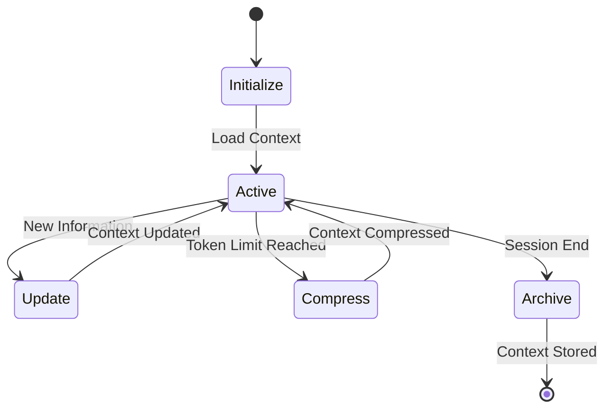

# Research

The goal is to be able to **maintain a knowledge base** of **various topics** that could be used by **multiple AI agents** at once through their **context window** and **shared across sessions**.

**Context engineering** is the field within *GenAI* that can provide the necessary techniques and frameworks to achieve this.

> **Context** is all we need :smiley:!

## The overall picture

The AI agents use the [context window](https://www.datacamp.com/blog/context-window?utm_cid=19589720821&utm_aid=186331392189&utm_campaign=230119_1-ps-other~dsa-tofu~all_2-b2c_3-emea_4-prc_5-na_6-na_7-le_8-pdsh-go_9-nb-e_10-na_11-na&utm_loc=9198645-&utm_mtd=-c&utm_kw=&utm_source=google&utm_medium=paid_search&utm_content=ps-other~emea-en~dsa~tofu~blog~generative-ai&gad_source=1&gad_campaignid=19589720821&gbraid=0AAAAADQ9WsGN7aTGJW9KK09cYyJKn2wJ1&gclid=Cj0KCQjw4PPNBhD8ARIsAMo-icxGq4OsQdIVo8VzB1SA-xtDrOxdTznS4ElVTcufkzr0h2ZIY3uQr4EaAvgZEALw_wcB) to group all the *new information* that will be used to tackle the requested tasks in each new conversation. This is the *LLM working memory within every new session*.

The working memory (context window) adds on top of the LLM in-house pretrained or fine-tuned knowledge to build up what the model *knows in each session*.  

> PROBLEMS WITH THE CONTEXT
>
> - The contexts are limited in size and time. They have limited length and they expire after each session.
> - The contexts may not have the best information to complete the tasks with the required quality. They are incomplete or not fully up-to-date.

### What can we do to improve the context?

- **Restriction of time** - Contexts expire after each session. Persist the information within the context to have it available for further usage in new sessions.
- **Restriction of size** - Context has limited length. Load only the necessary information, nothing else. Be picky. Prune the context.
- **Problems of quality** - Information may be incomplete or inaccurate. Look up for relevant information only. Provide external sources to retrieve valuable and up-to-date data.

### Pillars of Context Design

The pillars of Context Design must be considered when defining a Context Engineering solution:

- Context must be relevant.
- Context must be consciouse (compressed).
- Context must be clear.
- Context must be structured.

See [here](https://github.com/Corneldj/context-engineering/blob/main/Lessons/Module1/Lesson3_Core_Principles.md#1-the-four-pillars-of-context-design).

### How do we do it?

First we need to understand what is the **context window** made of. An AI agent context can be composed of the following:

- The user prompts.
- Custom prompts and custom instructions (system prompts).
- Agent reasoning steps and task outputs.
- Tools outputs.
- RAG applications outputs.
- Custom agents and skills.
- Loaded documents.


Another way to classify the composition of the context window is by the **type of memory** each content represents or what generated such content. Here, we would have:

- **Short-term memory/working memory** - Only available within a single session: user prompts, system prompts, agent reasoning, tools/RAG outputs. In summary, whatever we have within the context window.
- **Long-term memory** - Persisted and available across multiple sessions: loaded documents/knowledge graph/databases. Knowledge from documents can be loaded on-demand in every single session.
- **Procedural** - Inherited knowledge based on the agent features: custom agents and skills. Automatically loaded in every session.

So, given the previous, context engineering needs to cope with the following aspects:

- **Write context** - Persist the context so it can be used in future sessions.
- **Read context** - Load the context within the active session so it can be used by the agent/LLM.
- **Compress context** - To avoid size problems with the context, compression must be taken into consideration. Smaller context will work better and cheaper.
- **Isolate context** - Distribute the context accordingly among agents will increase performance and security.


## Context strategies

These are the main strategies applied to implement the previously outlined aspects. For a proper *context/memory management*, all should be addressed together in a context lifecycle process.

### Write context

> From current context window → to persistence layer.

- **Long-term memory**. It will be used in future sessions: user preferences, agent behaviour, project knowledge, conversation history.
- **Short-term memory**. Only for the current session: conversation history, current state.

**Question** here: how do we persist that context? What tools/mechanism to use?

### Read context

> From persistence layer and tools → to context window.

Here we have to deal with the different types of information sources available for our agent:

- Tools and MCP servers.
- RAG applications.
- Memory lookup (written context).

Here the challenge is to provide only the relevant information. As mentioned before, context windows have certain sizes. Also adding unuseful information to the context won't help our agents regarding performance and accuracy. To select only the most relevant, different methods can be unfolded:

- **Semantic search** - Retrieve similar data/information.
- **Rankings** - Use the most recent or latest updated.
- **Metadata** - Use metadata to classify and filter the context.
- **Task specific** - Retrieve only data related to a specific task.
- **Progressive loading** - Retrieve the information bit by bit, first an abstract, then and overview, then, only if needed, the complete information.
- **Tool selection** - Provide access only to the relevant tools.

### Compress context

Context is expensive. Not from a monetary point of view, but from a practical one. As highlighted before, too large contexts won't fit in size-constrained session windows. Also key points and essential information may end up buried under irrelevant data. Beside a proper selection of the context to read, **context compression** will help us including more useful information. Some useful techniques for a proper compression are:

- **Hierarchical summarization** - Structure the information in tiers or layers, from more abastract to more extended (abstract, overview, full content). This links with the *progressive loading* method in the context reading.
- **Entity extraction** - Cherry-pick key items like entities, relations and facts.
- **Template-base compression** - Use structured templates to provide a summary of the original content.
- **Trimming** - Remove older or less relevant parts of the context.

In any case, the compressed output must be validated to ensure the output hasn't lost the meaning and intention.

### Isolate context

Context isolation is important for multiple reasons:

- **Security** - Restrict access to sensitive information, avoid information disclosure, etc.
- **Specialization** - Context with specialized information leveraged by specialized agents.
- **Sandboxes** - Context is loaded in specific environments, like sanboxes and air-gaped environments.

## Context lifecycle

The context should be automatically managed through a given lifecycle. The lifecycle must ensure that:

- The *long-term memory* is loaded:
  - **Procedural memories** - Behaviour, skills, guardrails.
  - **Semantic memories** - Domain knowledge.
  - **Episodic memories** - Previous conversations, past stories, preferences.
- The *short-term memory* is tracked:
  - **Working memory** - Task output, task status, next steps, intermediate results.
- The context is **compressed and pruned** periodically.
- Before ending the current session, **the context is saved**:
  - Last task status, new domain knowledge, new story or last conversation, new preferences.


Additionally to the previous, what could be our baseline for a *healthy* context, we can add:

- **Quality validation** - Is the loaded information useful for the model?
- **Dynamic tool selection** - Can we help the model to choose the proper tools?
- **Query augmentation** - Can we help the user to provide a better query?




## Context management techniques

The techniques and tools described here can be used to implement the a context management lifecycle.

### Memory persistence

To persist the long-term and short-term memories, we can harness the following:

- File system - Use markdown files and other file formats (JSON, YAML, XML, etc) to save memories, templates and instructions on how to use them.
- Relational databases - Use relational databases like SQLite to easily save memories locally. Add search algorithms like [FTS5](https://www.sqlite.org/fts5.html).
- Vector databases (RAG)

### RAG (Retrieval Augmented Generation)

The following features must be considered when implementing a RAG system as part of our Context Management environment:

- Re-ranking - It will optimize retrieval by removing similar outputs. See [here](https://github.com/Corneldj/context-engineering/blob/main/Lessons/Module3/Lesson3_The_Retrieval_Process.md#2-optimizing-retrieval-beyond-basic-similarity)
- Hybrid search - Combining semantic (Vector DB, embeddings) and keyword search improves the results.

### Context Assembly

These are some useful techniques to implement a proper context window.

#### Context Aware Prompt

It is a good practice to prepare a Context aware system prompt where we clearly indicate where to place the different parts of the context, like the results retrieved by a RAG system. Additionally to standard prompt techniques like stating a ROLE, INSTRUCTIONS and OUTPUT format. Also, outline that **the model should not "invent" if the answer is not known is a good practice to avoid hallucinations**. See [here](https://github.com/Corneldj/context-engineering/blob/main/Lessons/Module3/Lesson4_The_Generation_and_Synthesis_Process.md):

```yaml
# ROLE
You are a helpful AI assistant for ACME Inc.

# INSTRUCTIONS
- Answer the user's QUESTION based ONLY on the provided CONTEXT.
- If the information to answer the question is not in the CONTEXT, you MUST say, "I do not have enough information to answer that question."
- Be concise and do not add any information that is not explicitly mentioned in the CONTEXT.
- For each piece of information you use, you MUST cite its source file in parentheses at the end of the sentence.

# CONTEXT
---
**Source:** [Source_1_Filepath_or_URL]
**Content:** [Content of chunk 1]
---
**Source:** [Source_2_Filepath_or_URL]
**Content:** [Content of chunk 2]
---

# QUESTION
[The original user query]
```

#### Context Sandwich

It is demonstrated that LLms focus more on the information found at the beginning and the end of the context window. Thus, include the most relevant information there, and use the rest to add additional details. See the ["Needle in the Haystack"](https://github.com/Corneldj/context-engineering/blob/main/Lessons/Module4/Lesson1_Mastering_the_Context_Window.md#1-the-needle-in-a-haystack-problem) problem.

### Long Conversation Management

Ideally we should "compress" the context from time to time, so the LLM/agent does not forget everything, but reduce the context size and keep the important parts only, at the same time. Cheaper LLMs can be used for this purpose.

Alternatively, if we do not need the whole conversation, **we can remove the older parts**. See [here](https://github.com/Corneldj/context-engineering/blob/main/Lessons/Module4/Lesson1_Mastering_the_Context_Window.md#2-strategies-for-managing-long-conversations).

#### Context Compression

Several techniques and best practices can be applied with the aim to compress the context. Some are outlined below:

- **Filtering**. Retrieval from RAG can be filtered by a cheaper LLM, ruling out content that is not relevant to the user prompt.
- **Compression**. Use a LLM to summarize the context, keeping only the relevant information. This can also be applied to the RAG output or to the overall context.

### Re-ranking the Context

For a top-notch accuracy and performance, we need to roll out some kind of **re-ranking** of the content of the context, especially for those outputs coming from RAG applications or any other form of knowledge base or long-running memory we may maintain.

Re-ranking implies "*cross-encoding*". That is, we cannot use embeddings or any other "short-cut" here. We need to cross the user prompt with the content of the documents or of our available information ready to be added to the context. That is a **slow process**.

> Re-ranking will get the set of proposed relevant information (for example, the documents retrieved from a RAG application), check their content and cross it with the user  prompt or among them and score them by relevance, then keep only the top-k most relevant.

Additional techniques can be put in place before re-ranking, to speed-up and improve the process:

- **Filter by metadata**. Use metadata attached to the context/retireved documents and filter based on relevance.

## Context Window Architecture

Is this [proposed architecture](https://github.com/Corneldj/context-engineering/blob/main/Lessons/Module7/Lesson4_Context_Window_Architecture.md) the "Holy Grail" for Context Management?

```
graph TD
    subgraph "High Attention Zone (Primacy)"
        L1[Layer 1: Instructions<br><i>System Prompt, Persona, Rules</i>]
        L2[Layer 2: User Info<br><i>Preferences, History</i>]
        L3[Layer 3: Curated Knowledge<br><i>RAG Results</i>]
        L4[Layer 4: Task/Goal State<br><i>Agent Plan & Status</i>]
    end

    subgraph "Middle (Lower Attention)"
        L5[Layer 5: Conversation History]
        L6[Layer 6: Internal Scratchpad<br><i>Chain-of-Thought</i>]
        L7[Layer 7: Tool Explanation<br><i>Function Calling Schemas</i>]
        L8[Layer 8: Security & Guardrails<br><i>Canaries, Defenses</i>]
        L9[Layer 9: Output Formatting<br><i>JSON, Markdown, etc.</i>]
        L10[Layer 10: Examples<br><i>Few-Shot Prompts</i>]
    end

    subgraph "High Attention Zone (Recency)"
        L11[Layer 11: User's Latest Query]
    end

    L1 --> L2 --> L3 --> L4 --> L5 --> L6 --> L7 --> L8 --> L9 --> L10 --> L11;

    style L1 fill:#cce5ff,stroke:#333,stroke-width:2px
    style L2 fill:#d4edff,stroke:#333,stroke-width:1px
    style L3 fill:#d4edff,stroke:#333,stroke-width:1px
    style L4 fill:#d4edff,stroke:#333,stroke-width:1px
    
    style L5 fill:#f2f2f2,stroke:#333,stroke-width:1px
    style L6 fill:#f2f2f2,stroke:#333,stroke-width:1px
    style L7 fill:#f2f2f2,stroke:#333,stroke-width:1px
    style L8 fill:#f2f2f2,stroke:#333,stroke-width:1px
    style L9 fill:#f2f2f2,stroke:#333,stroke-width:1px
    style L10 fill:#f2f2f2,stroke:#333,stroke-width:1px

    style L11 fill:#cce5ff,stroke:#333,stroke-width:2px
```

Hooks

MCP servers

Intermediate AI agents

Agent SDKs

## References

- [Context Engineering traning course](https://github.com/Corneldj/context-engineering)