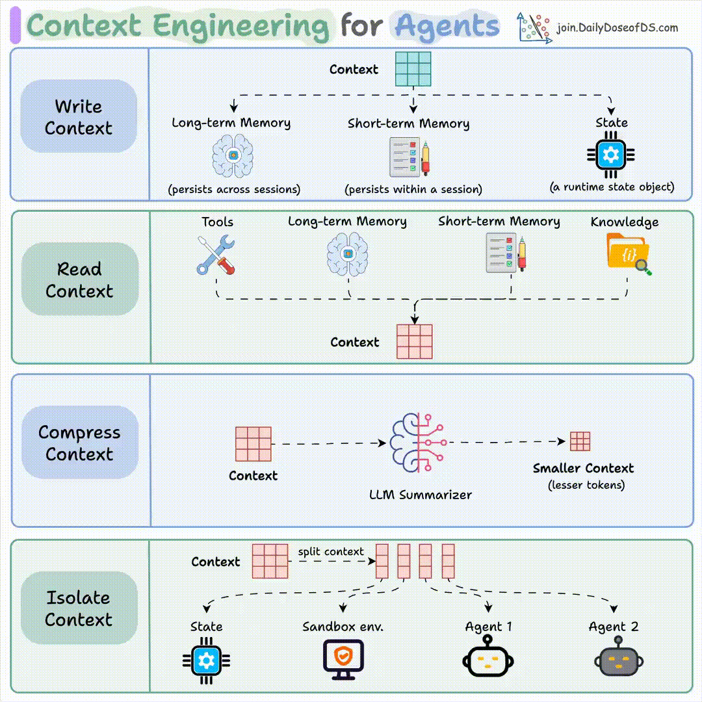
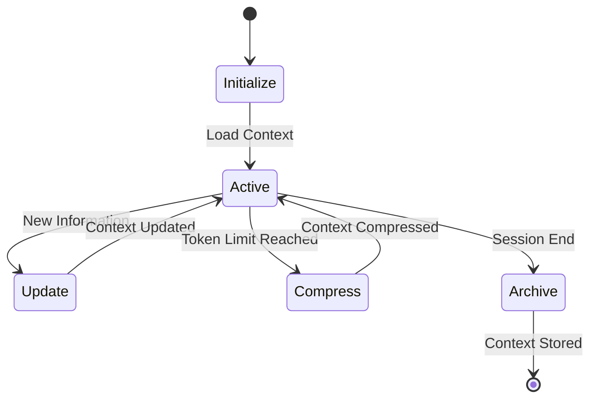

# Research

The goal is to be able to **maintain a knowledge base** of **various topics** that could be used by **multiple AI agents** at once through their **context window** and **shared across sessions**.

**Context engineering** is the field within *GenAI* that can provide the necessary techniques and frameworks to achieve this.

> **Context** is all we need :smiley:!

## The overall picture

The AI agents use the [context window](https://www.datacamp.com/blog/context-window?utm_cid=19589720821&utm_aid=186331392189&utm_campaign=230119_1-ps-other~dsa-tofu~all_2-b2c_3-emea_4-prc_5-na_6-na_7-le_8-pdsh-go_9-nb-e_10-na_11-na&utm_loc=9198645-&utm_mtd=-c&utm_kw=&utm_source=google&utm_medium=paid_search&utm_content=ps-other~emea-en~dsa~tofu~blog~generative-ai&gad_source=1&gad_campaignid=19589720821&gbraid=0AAAAADQ9WsGN7aTGJW9KK09cYyJKn2wJ1&gclid=Cj0KCQjw4PPNBhD8ARIsAMo-icxGq4OsQdIVo8VzB1SA-xtDrOxdTznS4ElVTcufkzr0h2ZIY3uQr4EaAvgZEALw_wcB) to group all the *new information* that will be used to tackle the requested tasks in each new conversation. This is the *LLM working memory within every new session*.

The working memory (context window) adds on top of the LLM in-house pretrain or fine-tuned knowledge to build up what the model *knows in each session*.  

> PROBLEMS WITH THE CONTEXT
>
> - The contexts are limited in size and time. They have limited length and they expire after each session.
> - The contexts may not have the best information to complete the tasks with the required quality. They are incomplete or not fully up-to-date.

### What can we do to improve the context?

- **Restriction of time** - Contexts expire after each session. Persist the information within the context to have it available for further usage in new sessions.
- **Restriction of size** - Context has limited length. Load only the necessary information, nothing else. Be picky. Prune the context.
- **Problems of quality** - Information may be incomplete or inaccurate. Look up for relevant information only. Provide external sources to retrieve valuable and up-to-date data.

### How do we do it?

First we need to understand what is the **context window** made of. An AI agent context can be composed of the following:

- The user prompts.
- Custom prompts and custom instructions (system prompts).
- Agent reasoning steps and task outputs.
- Tools outputs.
- RAG applications outputs.
- Custom agents and skills.
- Loaded documents.

Another way to classify the composition of the context window is by the **type of memory** each content represents or what generated such content. Here, we would have:

- **Short-term memory/working memory** - Only available within a single session: user prompts, system prompts, agent reasoning, tools/RAG outputs. In summary, whatever we have within the context window.
- **Long-term memory** - Persisted and available across multiple sessions: loaded documents. Knowledge from documents can be loaded on-demand in every single session.
- **Procedural** - Inherited knowledge based on the agent features: custom agents and skills. Automatically loaded in every session.

So, given the previous, context engineering needs to cope with the following aspects:

- **Write context** - Persist the context so it can be used in future sessions.
- **Read context** - Load the context within the active session so it can be used by the agent/LLM.
- **Compress context** - To avoid size problems with the context, compression must be taken into consideration. Smaller context will work better and cheaper.
- **Isolate context** - Distribute the context accordingly among agents will increase performance and security.

## Context strategies

These are the main strategies applied to implement the previously outlined aspects. For a proper *context/memory management*, all should be addressed together in a context lifecycle process.

### Write context

> From current context window --> to persistence layer.

- **Long-term memory**. It will be used in future sessions: user preferences, agent behaviour, project knowledge, conversation history.
- **Short-term memory**. Only for the current session: conversation history, current state.

**Question** here: how do we persist that context? What tools/mechanism to use?

### Read context

> From persistence layer and tools --> to context window.

Here we have to deal with the different types of information sources available for our agent:

- Tools and MCP servers.
- RAG applications.
- Memory lookup (written context).

Here the challenge is to provide only the relevant information. As mentioned before, context windows have certain sizes. Also adding unuseful information to the context won't help our agents regarding performance and accuracy. To select only the most relevant, different methods can be unfolded:

- **Semantic search** - Retrieve similar data/information.
- **Rankings** - Use the most recent or latest updated.
- **Task specific** - Retrieve only data related to a specific task.
- **Progressive loading** - Retrieve the information bit by bit, first an abstract, then and overview, then, only if needed, the complete information.
- **Tool selection** - Provide access only to the relevant tools.

### Compress context

Context is expensive. Not from a monetary point of view, but from a practical one. As highlighted before, too large contexts won't fit in size-constrained session windows. Also key points and essential information may end up buried under irrelevant data. Beside a proper selection of the context to read, **context compression** will help us including more useful information. Some useful techniques for a proper compression are:

- **Hierarchical summarization** - Structure the information in tiers or layers, from more abastract to more extended (abstract, overview, full content). This links with the *progressive loading* method in the context reading.
- **Entity extraction** - Cherry-pick key items like entities, relations and facts.
- **Template-base compression** - Use structured templates to provide a summary of the original content.
- **Trimming** - Remove older or less relevant parts of the context.

In any case, the compressed output must be validated to ensure the output hasn't lost the meaning and intention.

### Isolate context

Context isolation is important for multiple reasons:

- **Security** - Restrict access to sensitive information, avoid information disclosure, etc.
- **Specialization** - Context with specialized information leveraged by specialized agents.
- **Sandboxes** - Context is loaded in specific environments, like sanboxes and air-gaped environments.

## Context lifecycle

